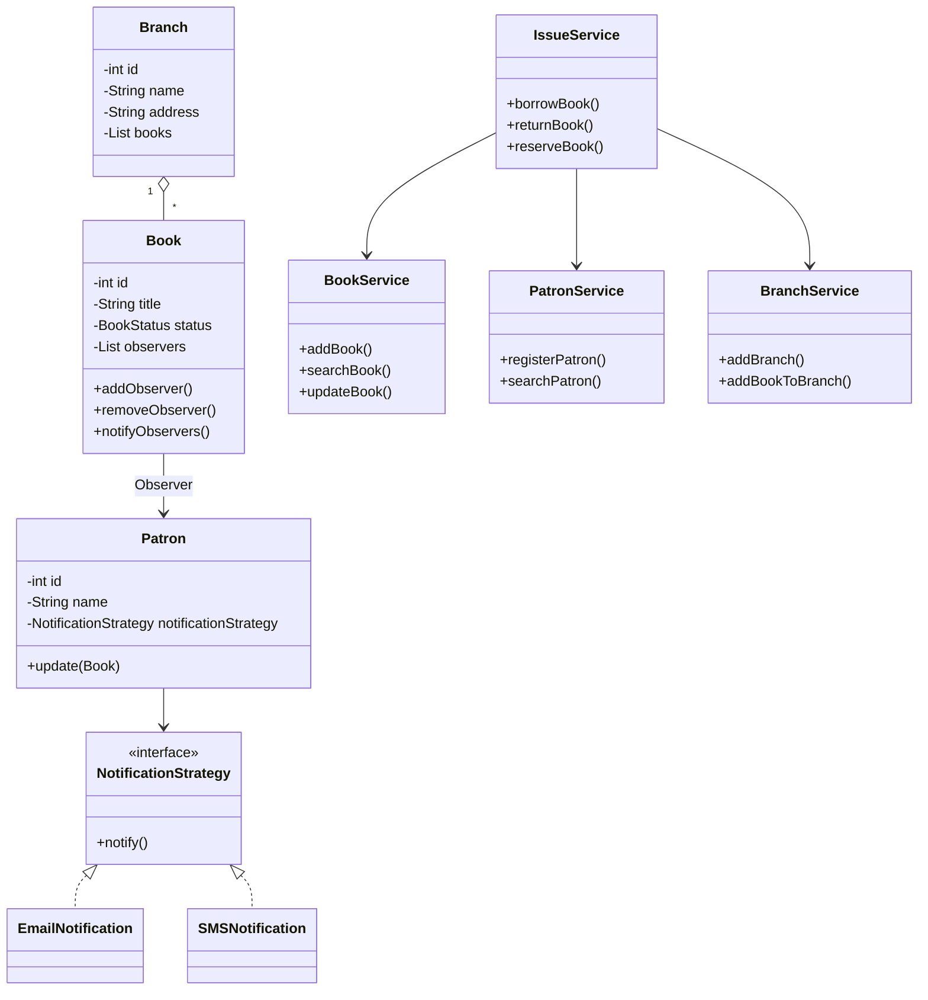

# 📚 Library Management System

## Overview

Library Management System is an in-memory Java application developed to demonstrate Object-Oriented Programming (OOP), SOLID principles, Java Collections Framework, Exception Handling, Generics, and Design Patterns.

The system allows librarians to manage books, patrons, and branches while supporting book borrowing, returning, and reservation. Patrons who reserve unavailable books are notified automatically when the book becomes available.

---

## Features

### Book Management
- Add books
- Update book details
- Search books by ID or title
- Remove books

### Patron Management
- Register patrons
- Search patrons
- Update patron details

### Branch Management
- Add branches
- Add books to branches
- Search branches

### Circulation Management
- Borrow books
- Return books
- Reserve unavailable books
- Notify reserved patrons when books become available

---

# Project Structure

```
src
│
├── entity
│   ├── Book
│   ├── Patron
│   ├── Branch
│   └── ...
│
├── service
│   ├── BookService
│   ├── PatronService
│   ├── BranchService
│   └── IssueService
│
├── interfaces
│
├── exception
│
├── util
│
├── enums
│
└── test
    └── TestRunner
```

---

## Class Diagram



# System Design

## Entities

### Book
Represents a library book. Maintains the list of patrons waiting for the book using the Observer pattern.

### Patron
Represents a library member. Receives notifications when reserved books become available.

### Branch
Represents a library branch and maintains its collection of books.

---

## Services

### BookService

Responsible for:

- Add books
- Update books
- Search books
- Remove books

---

### PatronService

Responsible for:

- Register patrons
- Search patrons
- Update patron details

---

### BranchService

Responsible for:

- Add branches
- Search branches
- Maintain books available in a branch

---

### IssueService

Responsible for:

- Borrow books
- Return books
- Reserve books
- Coordinate interactions between books and patrons

IssueService uses BookService and PatronService instead of directly managing collections.

---

# Design Patterns Used

## 1. Singleton Pattern

**Class**

- IdGenerator

**Purpose**

Ensures a single instance is responsible for generating unique IDs throughout the application.

---

## 2. Observer Pattern

**Subject**

Book

**Observers**

Patron

**Purpose**

When a reserved book becomes available, all subscribed patrons are automatically notified.

---

## 3. Strategy Pattern

**Strategy**

NotificationStrategy

**Implementations**

- EmailNotification
- SMSNotification
- ConsoleNotification (if implemented)

**Purpose**

Allows different notification mechanisms without modifying Patron or Book.

---

# SOLID Principles

## Single Responsibility Principle

Each service has one responsibility.

- BookService manages books.
- PatronService manages patrons.
- BranchService manages branches.
- IssueService manages circulation.

---

## Open/Closed Principle

Notification mechanisms can be extended by adding new NotificationStrategy implementations without modifying existing classes.

---

## Liskov Substitution Principle

Different NotificationStrategy implementations can replace each other without affecting client code.

---

## Interface Segregation Principle

Small focused interfaces are used instead of large monolithic interfaces.

---

## Dependency Inversion Principle

IssueService depends on BookService and PatronService abstractions to perform borrowing and reservation operations instead of directly accessing collections.

---

# Exception Handling

Custom exceptions are used for exceptional situations.

Examples:

- BookNotFoundException
- PatronNotFoundException
- BookNotBorrowableException
- ReservationNotAllowedException

---

# Assumptions

- Data is stored in memory.
- No database is used.
- IDs are generated automatically.
- A patron cannot borrow an unavailable book.
- Patrons may reserve unavailable books.
- Reserved patrons are notified automatically when the book is returned.

---

# Future Enhancements

- Database integration
- Spring Boot REST APIs
- Authentication & Authorization
- Fine calculation
- Book transfer between branches
- Persistent storage

---

# How to Run

1. Clone the repository.
2. Open the project in IntelliJ IDEA.
3. Compile the project.
4. Run `TestRunner.java`.
